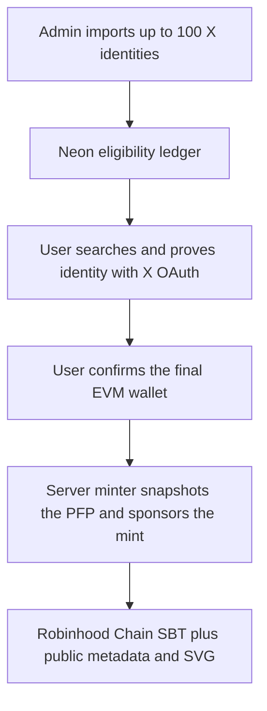

# Bunny Hood

Bunny Hood is a production Next.js application deployed on Vercel. Its Rabbit Hole experience lets an allowlisted X identity claim one unique, gas-sponsored Soulbound Token (SBT) on Robinhood Chain.

> **Permanent means permanent.** The Rabbit Hole token cannot be transferred, approved, sold, burned, recovered, or moved to another wallet. The receiving wallet must be correct before minting.

## Production routes

| Route | Purpose | Current access |
| --- | --- | --- |
| [`/RabbitHole`](https://www.bunnyhood.xyz/RabbitHole) | Eligibility search, X verification, wallet entry, realtime mint status, SBT result, and admin eligibility manager | Admin-only while `RABBIT_HOLE_PUBLIC=false` |
| [`/admin/spin?next=/RabbitHole`](https://www.bunnyhood.xyz/admin/spin?next=/RabbitHole) | Admin sign-in and redirect to Rabbit Hole | Admin password required |
| [`/SpinTheWheel`](https://www.bunnyhood.xyz/SpinTheWheel) | X-connected rewards and wheel experience | Public |
| `/auction/*` | Retired auction URLs | Permanently redirect to `/RabbitHole` |

The Rabbit Hole metadata and SVG image endpoints remain public even in admin-preview mode so wallets and block explorers can render minted tokens.

## Contents

- [What the user receives](#what-the-user-receives)
- [How a claim works](#how-a-claim-works)
- [Admin guide: add the eligible users](#admin-guide-add-the-eligible-users)
- [Claim statuses](#claim-statuses)
- [Contract behavior and every function](#contract-behavior-and-every-function)
- [Application and API reference](#application-and-api-reference)
- [Database and artwork](#database-and-artwork)
- [Local setup](#local-setup)
- [Environment variables](#environment-variables)
- [Deploy the contract](#deploy-the-contract)
- [Deploy the application](#deploy-the-application)
- [Testnet-to-mainnet launch](#testnet-to-mainnet-launch)
- [Security review](#security-review)
- [Incident response](#incident-response)
- [Troubleshooting](#troubleshooting)
- [Checks and source map](#checks-and-source-map)

## System overview



The browser never receives a private key and does not send the mint transaction. Bunny Hood's server-side minter pays the gas, submits the transaction, waits for one confirmation, and records the result in Neon.

## What the user receives

An eligible user receives:

- One `Bunny Hood Rabbit Hole` token (`BHRH`) at the exact EVM address they entered.
- A unique sequential token ID and onchain ownership record on the configured Robinhood Chain network.
- A unique box image containing the X profile picture captured at claim time, the X username and display name, `BH` on the side, `?` on top, and a permanently soulbound badge.
- Public NFT metadata and SVG artwork that wallets and explorers can request.
- Links to the mint transaction and token page on the relevant Robinhood Chain explorer.
- A mint sponsored by Bunny Hood. The user connects X and enters an address; the app minter sends the blockchain transaction and pays its gas.

The user does **not** receive a tradable NFT. Wallets may display the SBT under an NFT tab because it uses ERC-721 interfaces, and some marketplaces may still show generic list or transfer controls, but every approval and transfer call reverts onchain.

The token cannot be:

- transferred with `transferFrom` or either `safeTransferFrom` overload;
- approved with `approve` or `setApprovalForAll`;
- sold through a marketplace, because a sale requires approval or transfer;
- burned, because the contract exposes no burn function;
- recovered or reassigned by Bunny Hood; or
- moved after a wrong address is entered or the wallet is lost.

The SBT implements the final [ERC-5192 Minimal Soulbound NFT standard](https://eips.ethereum.org/EIPS/eip-5192). `locked(tokenId)` always returns `true` for an existing token and the contract advertises interface ID `0xb45a3c0e`.

## How a claim works

1. An admin loads up to 100 X identities into the private eligibility manager.
2. A visitor opens `/RabbitHole`. While the preview flag is off, the page and its search/claim APIs require the existing Bunny Hood admin session.
3. The visitor searches an X username. Search only reveals eligibility and claim status; it does not prove ownership.
4. The visitor selects **CONNECT X TO CONTINUE**. OAuth 2.0 with PKCE requests only `tweet.read` and `users.read` and returns to `/RabbitHole`.
5. The server matches the authenticated immutable X user ID to a pre-bound row. If the row only contains a username, the first authenticated X account with that exact handle permanently binds its X user ID to the row.
6. The eligible user enters the final EVM receiving address and confirms the permanent-wallet warning.
7. The server validates the wallet, selected network, deployed contract bytecode, and that the configured signer is the contract's current minter.
8. The server checks both the X-derived claim key and the wallet onchain to prevent a duplicate claim.
9. The server downloads the user's current X profile picture from an approved X image host and stores a safe snapshot for the artwork.
10. Neon creates an auditable claim attempt and marks the eligibility row `minting` under database locks and uniqueness constraints.
11. The server-side minter simulates and submits `mint(recipient, metadataUrl, claimKey)`. The UI shows the transaction and polls the chain every three seconds.
12. After one confirmation, the server reads the token ID from `tokenOfClaim`, marks the row `claimed`, and displays the personalized SBT.
13. If the HTTP request times out after submission, later polling reconciles the claim from `tokenOfClaim` instead of minting a second token.

The deterministic claim key is:

```text
keccak256("bunnyhood:rabbit-hole:" + immutable_x_user_id)
```

The username search is therefore only a discovery tool. Eligibility is finally enforced against the authenticated X identity and the onchain claim key.

## Admin guide: add the eligible users

### Open the manager

1. Open [`/admin/spin?next=/RabbitHole`](https://www.bunnyhood.xyz/admin/spin?next=/RabbitHole).
2. Enter the existing Bunny Hood admin password.
3. After redirecting to `/RabbitHole`, scroll to **PRIVATE ADMIN · ELIGIBILITY MANAGER**.
4. Paste the complete desired editable list into **REPLACE EDITABLE ELIGIBILITY LIST**.
5. Select **IMPORT LIST**, confirm the replacement, and verify the loaded/claimed/minting/failed counters and table.

The form replaces the editable list; it is not an append-only import. Always paste every unclaimed user who should remain eligible.

### Accepted formats

Use one identity per line. Commas and tabs are accepted between the username and optional X user ID.

```text
username
@another_user
https://x.com/thirduser
fourth_user,123456789012345678
fifth_user	987654321098765432
```

An optional first-line header is supported:

```csv
username,x_user_id
alice,123456789
bob,987654321
```

Blank lines and lines beginning with `#` are ignored. Usernames are normalized to lowercase and must contain 1–15 letters, numbers, or underscores. An X user ID, when supplied, must contain 1–30 digits.

### Strongly recommended identity format

Use `username,numeric_x_user_id` whenever possible. The numeric ID is the immutable identity returned by the X API and remains the same if the account changes its handle.

A username-only entry is less secure operationally: the first OAuth-authenticated X account matching that handle becomes permanently bound to the row. Review handle changes before public launch and do not obtain X IDs from an untrusted lookup service.

### Import rules

- The editable import contains at most 100 entries.
- Duplicate normalized usernames or duplicate X user IDs are rejected.
- An already-bound username cannot be rebound to a different X user ID.
- Existing rows in `claimed` or `minting` state are preserved even if omitted from the replacement.
- Unclaimed rows omitted from the replacement are deleted.
- A replacement is rejected if its entries plus preserved claimed/minting rows would exceed 100.
- The admin import is recorded in the application admin audit log.

> **Supply boundary:** the application and eligibility database enforce the 100-user limit. The deployed Solidity contract does **not** contain a hard `maxSupply` of 100. A compromised or malicious minter could mint beyond the application list. See [Security review](#security-review).

### Admin search

The records panel can search by X username, numeric X ID, wallet address, or transaction hash. It shows the current identity status, receiving wallet, and token ID.

## Claim statuses

| Status | Meaning | User/admin action |
| --- | --- | --- |
| `not_eligible` | No row matches the searched or authenticated identity | Admin checks the full eligibility import; user connects the exact listed X account |
| `eligible` | Identity is loaded and has not begun a successful mint | Connect X, verify the final wallet, and claim |
| `minting` | A locked claim attempt exists; a transaction may be processing or submitted | Wait and keep polling; do not manually create another claim |
| `claimed` | Onchain token was found and the database has its wallet, token, contract, chain, and claim time | View the transaction/SBT; no further claim is possible |
| `failed` | The previous attempt failed before confirmation or a submitted transaction reverted | Correct the reported operational problem, then retry from the same eligible identity |

Claim-attempt audit rows use the more detailed states `processing`, `submitted`, `confirmed`, `failed`, and `reconciled`.

## Contract behavior and every function

Source: [`contracts/BunnyHoodRabbitHoleSBT.sol`](contracts/BunnyHoodRabbitHoleSBT.sol)

Deployment script defaults:

| Item | Value |
| --- | --- |
| Contract | `BunnyHoodRabbitHoleSBT` |
| Collection name | `Bunny Hood Rabbit Hole` |
| Symbol | `BHRH` |
| Solidity pragma | `^0.8.24` |
| Current artifact compiler | `0.8.36+commit.8a079791` |
| Optimizer | Enabled, 200 runs |
| EVM target | `paris` |
| Token IDs | Begin at `1` and increment by one |

### Constructor

```solidity
constructor(
    string collectionName,
    string collectionSymbol,
    address initialOwner,
    address initialMinter
)
```

Both role addresses must be nonzero. The deployment script uses the configured owner and makes the private-key account the initial minter.

### Read functions

| Function | Return/behavior |
| --- | --- |
| `name()` | Collection name |
| `symbol()` | Collection symbol |
| `owner()` | Address allowed to rotate the minter and transfer contract ownership |
| `minter()` | Only address allowed to call `mint` |
| `balanceOf(account)` | `0` or `1`; rejects the zero address |
| `ownerOf(tokenId)` | Current and permanent token owner; rejects a missing token |
| `tokenURI(tokenId)` | Metadata URL stored at mint; rejects a missing token |
| `tokenOfClaim(claimKey)` | Token ID for an X-derived claim key, or `0` if unused |
| `tokenOfOwner(account)` | Token ID held by an address, or `0` if none |
| `totalSupply()` | Number of tokens minted by this deployment |
| `locked(tokenId)` | Always `true` for an existing token; ERC-5192 |
| `getApproved(tokenId)` | Always the zero address for an existing token |
| `isApprovedForAll(owner, operator)` | Always `false` |
| `supportsInterface(interfaceId)` | Supports ERC-165, ERC-721, ERC-721 metadata, and ERC-5192 |

### State-changing functions

| Function | Who can call | Behavior |
| --- | --- | --- |
| `mint(recipient, uri, claimKey)` | Current `minter` only | Rejects zero recipient/key, a reused claim key, or a wallet that already owns an SBT; records the token; emits mint/lock events; safely checks `IERC721Receiver` when the recipient is a contract |
| `setMinter(nextMinter)` | Current `owner` only | Replaces the authorized minter; the new address must be nonzero |
| `transferOwnership(nextOwner)` | Current `owner` only | Replaces the contract owner; the new address must be nonzero |
| `approve(address, tokenId)` | Anyone may attempt | Always reverts `Soulbound()` |
| `setApprovalForAll(operator, approved)` | Anyone may attempt | Always reverts `Soulbound()` |
| `transferFrom(from, to, tokenId)` | Anyone may attempt | Always reverts `Soulbound()` |
| `safeTransferFrom(from, to, tokenId)` | Anyone may attempt | Always reverts `Soulbound()` |
| `safeTransferFrom(from, to, tokenId, data)` | Anyone may attempt | Always reverts `Soulbound()` |

There is no burn, pause, recovery-transfer, metadata-update, or owner-withdrawal function.

### Events

| Event | When emitted |
| --- | --- |
| `Transfer(0x0, recipient, tokenId)` | Token is minted |
| `Locked(tokenId)` | Token is minted permanently locked |
| `SoulboundMinted(recipient, tokenId, claimKey, tokenUri)` | Full Bunny Hood mint record |
| `MinterUpdated(previousMinter, newMinter)` | Initial deployment or owner rotation |
| `OwnershipTransferred(previousOwner, newOwner)` | Initial deployment or ownership transfer |

The ERC-721 `Approval` and `ApprovalForAll` events are declared for interface compatibility but cannot be reached through successful approval functions.

## Application and API reference

### Public/application routes

| Method and route | Access | Function |
| --- | --- | --- |
| `GET /RabbitHole` | Admin cookie unless `RABBIT_HOLE_PUBLIC=true` | Renders the complete Rabbit Hole experience and admin manager |
| `GET /api/rabbit-hole/status?username=...` | Same Rabbit Hole access gate | Validates a username and returns public eligibility, claimed count, and network status |
| `GET /api/rabbit-hole/me` | Same Rabbit Hole access gate | Returns X session identity, bound eligibility, counters, and network; reconciles an in-flight claim |
| `GET /api/rabbit-hole/auth/x/start` | Same Rabbit Hole access gate | Starts X OAuth with PKCE and a sealed ten-minute state cookie |
| `POST /api/rabbit-hole/claim` | Rabbit Hole access, authenticated X session, same origin | Validates and starts/reconciles a gas-sponsored SBT claim; limited to four attempts per five minutes per session identity |
| `GET /api/rabbit-hole/metadata/:claimId` | Public | Returns wallet-compatible JSON metadata for a minting or claimed record |
| `GET /api/rabbit-hole/image/:claimId` | Public | Returns the personalized SVG for a minting or claimed record |
| `GET /api/admin/rabbit-hole/eligibility?search=...` | Admin only | Returns detailed rows and status counts |
| `POST /api/admin/rabbit-hole/eligibility` | Admin and same-origin only | Parses and replaces the editable eligibility list |

The public metadata endpoints intentionally reveal the X username, rendered profile snapshot, token number, and chain information associated with a public blockchain token. Do not use this drop for identities that require private metadata.

### Core server functions

| Module | Functions | Responsibility |
| --- | --- | --- |
| `lib/rabbit-hole/config.ts` | `normalizeXUsername`, `isValidXUsername`, `isRabbitHolePublic`, `getRabbitHoleNetwork`, `getRabbitHoleMinterKey` | Input normalization, access flag, chain selection, addresses, RPC, and secret-key validation |
| `lib/rabbit-hole/chain.ts` | `getRabbitHoleChainClients`, `getRabbitHolePublicClient` | Creates server-only viem public/wallet clients |
| `lib/rabbit-hole/schema.ts` | `ensureRabbitHoleSchema` | Applies migration `009_rabbit_hole_sbt` once under an advisory lock |
| `lib/rabbit-hole/data.ts` | `publicEligibility`, `findEligibilityByUsername`, `getEligibilityById`, `bindAuthenticatedEligibility`, `getEligibilityStats`, `listEligibility`, `parseEligibilityImport`, `replaceEligibility` | Eligibility parsing, X binding, admin list management, counters, and public response shaping |
| `lib/rabbit-hole/art.ts` | `snapshotXProfileImage`, `escapeXml`, `renderRabbitHoleSbtSvg` | Safe X PFP capture and escaped SVG generation |
| `lib/rabbit-hole/claim.ts` | `rabbitHoleClaimKey`, `reconcileRabbitHoleClaim`, `mintRabbitHoleSbt` | Deterministic identity key, crash/timeout recovery, duplicate protection, sponsored mint, and final database record |

## Database and artwork

Neon PostgreSQL is the application source of truth for eligibility, X bindings, personalized art, claim attempts, and the mapping from an offchain claim to its onchain result. The blockchain remains the source of truth for token ownership and soulbound behavior.

Migration `009_rabbit_hole_sbt` creates:

| Table | Purpose |
| --- | --- |
| `rabbit_hole_eligibility` | One row per loaded X identity with status, immutable X binding, PFP snapshot, wallet, claim key, transaction, token, contract, chain, metadata URL, failure, and timestamps |
| `rabbit_hole_claim_attempts` | Append-style operational ledger for processing, submitted, confirmed, failed, and reconciled attempts |

Database protections include unique normalized usernames, unique X IDs, unique claim keys and transaction hashes, a partial unique index preventing one wallet from being used by multiple active/claimed rows, format checks, and a constraint requiring every claimed row to contain its full onchain result.

The schema is applied lazily through `ensureRabbitHoleSchema()` and recorded in `spin_schema_migrations`. [`db/migrations/009_rabbit_hole_sbt.sql`](db/migrations/009_rabbit_hole_sbt.sql) is retained for review and manual recovery.

### Artwork persistence model

- At claim time, the server upgrades the X image URL to a 400×400 version when possible.
- Only HTTPS images from `pbs.twimg.com` and `abs.twimg.com` are accepted.
- Redirects are rejected; the request times out after ten seconds.
- Only JPEG, PNG, and WebP are accepted, with a maximum size of 1 MB.
- The bytes are stored as a base64 snapshot in Neon, so a later X profile-picture change does not change the claimed art.
- User-controlled text is XML-escaped before SVG rendering.
- The onchain `tokenURI` points to Bunny Hood's metadata endpoint. Ownership survives an application outage, but metadata rendering currently depends on the Bunny Hood domain and Neon database; it is not IPFS/Arweave-immutable.

## Local setup

### Prerequisites

- Node.js 22.x and npm.
- A Neon/PostgreSQL database.
- An X Developer App with OAuth 2.0 enabled.
- A funded EVM account for Robinhood Chain Testnet before testing contract deployment.

Install and prepare the environment:

```bash
git clone https://github.com/PAFRehman/bunnyhood.git
cd bunnyhood
npm ci
cp .env.example .env.local
node scripts/generate-secrets.mjs
node scripts/hash-admin-password.mjs "USE-A-LONG-UNIQUE-ADMIN-PASSWORD"
```

Copy generated values into `.env.local`; do not paste secrets into source files or commit `.env.local`.

Run the application:

```bash
npm run contract:check
npm run dev
```

Open `http://localhost:3000/admin/spin?next=/RabbitHole`, sign in, and test with `RABBIT_HOLE_PUBLIC=false`.

For local X OAuth, the X Developer App must also allow the exact local callback configured in `X_REDIRECT_URI`. Production uses the shared callback:

```text
https://www.bunnyhood.xyz/api/spin/auth/x/callback
```

## Environment variables

Start from [`.env.example`](.env.example). Never prefix the minter key, private RPC, database URL, X secret, or admin secret with `NEXT_PUBLIC_`.

### Rabbit Hole and chain

| Variable | Required where | Purpose |
| --- | --- | --- |
| `RABBIT_HOLE_PUBLIC` | App | `false` keeps page/search/OAuth/claim behind admin; `true` launches public access |
| `RABBIT_HOLE_NETWORK` | App and deploy shell | Exact value `mainnet` selects chain 4663; every other value selects testnet 46630, so set it explicitly |
| `RABBIT_HOLE_TESTNET_CONTRACT_ADDRESS` | App when testing | Testnet deployment address |
| `RABBIT_HOLE_MAINNET_CONTRACT_ADDRESS` | App on mainnet | Mainnet deployment address |
| `RABBIT_HOLE_MINTER_PRIVATE_KEY` | App and deploy shell | 32-byte `0x` private key for the sponsored minter; server-only |
| `RABBIT_HOLE_OWNER_ADDRESS` | Deploy shell only | Owner that can rotate the minter/ownership; use a separate multisig on mainnet |
| `ROBINHOOD_TESTNET_RPC_URL` | App and deploy shell | Private testnet RPC recommended for reliability |
| `ROBINHOOD_MAINNET_RPC_URL` | App and deploy shell | Private mainnet RPC recommended for reliability |

If a private RPC is absent, the code falls back to Robinhood Chain's public RPC. Robinhood documents those endpoints as rate-limited and not recommended for production; see [Connecting to Robinhood Chain](https://docs.robinhood.com/chain/connecting/).

### Shared application requirements

| Variable | Purpose |
| --- | --- |
| `APP_URL` | Canonical HTTPS origin without a trailing slash; used in metadata URLs and origin checks |
| `DATABASE_URL` | Pooled Neon/PostgreSQL connection string |
| `X_CLIENT_ID`, `X_CLIENT_SECRET`, `X_REDIRECT_URI` | X OAuth configuration; callback must match the X Developer Portal exactly |
| `TOKEN_ENCRYPTION_KEY` | Seals OAuth/session payloads |
| `RATE_LIMIT_SECRET` | Produces private rate-limit keys |
| `ADMIN_SESSION_SECRET` | Signs the existing admin session |
| `ADMIN_PASSWORD_HASH` | Scrypt hash used by `/admin/spin` |

The wider Spin The Wheel application also uses the remaining secrets documented in `.env.example` and [`SPIN_THE_WHEEL_SETUP.md`](SPIN_THE_WHEEL_SETUP.md).

## Deploy the contract

Robinhood Chain is EVM-compatible and uses ETH for gas. Official network details and deployment guidance are available in [Robinhood Chain: Deploy a Contract](https://docs.robinhood.com/chain/deploy-smart-contracts/).

| Network | Chain ID | Public RPC | Explorer |
| --- | ---: | --- | --- |
| Robinhood Chain Testnet | `46630` | `https://rpc.testnet.chain.robinhood.com` | [`explorer.testnet.chain.robinhood.com`](https://explorer.testnet.chain.robinhood.com) |
| Robinhood Chain Mainnet | `4663` | `https://rpc.mainnet.chain.robinhood.com` | [`robinhoodchain.blockscout.com`](https://robinhoodchain.blockscout.com) |

Use a private provider endpoint in production and deploy to testnet first.

### 1. Prepare roles and funds

- Create a dedicated minter account. It is also the deployer used by `scripts/deploy-sbt.mjs`.
- Fund that account with enough ETH on the selected Robinhood Chain network for deployment and every sponsored user mint.
- Choose a separate owner, preferably a tested multisig on mainnet.
- Back up both roles securely. Never use a personal treasury wallet as the application minter.

The deployment script defaults the owner to the minter when `RABBIT_HOLE_OWNER_ADDRESS` is omitted. This is convenient for a throwaway test but not recommended for mainnet.

### 2. Compile and run invariant checks

```bash
npm ci
npm run contract:check
```

This regenerates [`contracts/artifacts/BunnyHoodRabbitHoleSBT.json`](contracts/artifacts/BunnyHoodRabbitHoleSBT.json) and fails if the required transfer/approval reverts, both `safeTransferFrom` reverts, ERC-5192 support, no-burn invariant, ABI, or bytecode is missing.

### 3. Set secure testnet variables

macOS/Linux:

```bash
export RABBIT_HOLE_NETWORK="testnet"
export RABBIT_HOLE_MINTER_PRIVATE_KEY="0xYOUR_64_HEX_CHARACTER_PRIVATE_KEY"
export RABBIT_HOLE_OWNER_ADDRESS="0xYOUR_OWNER_OR_MULTISIG_ADDRESS"
export ROBINHOOD_TESTNET_RPC_URL="https://YOUR_PRIVATE_TESTNET_RPC"
```

PowerShell:

```powershell
$env:RABBIT_HOLE_NETWORK = "testnet"
$env:RABBIT_HOLE_MINTER_PRIVATE_KEY = "0xYOUR_64_HEX_CHARACTER_PRIVATE_KEY"
$env:RABBIT_HOLE_OWNER_ADDRESS = "0xYOUR_OWNER_OR_MULTISIG_ADDRESS"
$env:ROBINHOOD_TESTNET_RPC_URL = "https://YOUR_PRIVATE_TESTNET_RPC"
```

Do not put a real key into shell history on a shared computer. Prefer an isolated deployment machine or secret-injection system.

### 4. Deploy

```bash
npm run contract:deploy
```

The script:

1. loads the compiled ABI and bytecode;
2. validates the private key and owner address;
3. deploys with name `Bunny Hood Rabbit Hole`, symbol `BHRH`, the selected owner, and the private-key account as minter;
4. waits for one confirmation; and
5. prints the deployment transaction, contract address, and exact application variable to set.

Record the transaction, contract address, owner, minter, compiler settings, git commit, and deployment date in a secure release log.

### 5. Verify on Blockscout

The deploy script does not automatically publish source verification. Open the printed contract address in the selected explorer, choose the contract verification/publish flow, and use:

| Setting | Value |
| --- | --- |
| Source | `contracts/BunnyHoodRabbitHoleSBT.sol` |
| Contract name | `BunnyHoodRabbitHoleSBT` |
| Compiler | Exact `compilerVersion` in the generated artifact (currently `v0.8.36+commit.8a079791`) |
| Optimization | Enabled |
| Runs | `200` |
| EVM version | `paris` |
| License | MIT |
| Constructor types | `string,string,address,address` |
| Constructor values | `Bunny Hood Rabbit Hole`, `BHRH`, deployed owner, deployed minter |

Follow the explorer's expected constructor-argument format. The official Robinhood deployment guide documents Blockscout verification URLs for both networks.

### 6. Verify roles and invariants onchain

Before connecting the app, inspect the verified read methods:

- `owner()` equals the intended owner/multisig;
- `minter()` equals the address derived from `RABBIT_HOLE_MINTER_PRIVATE_KEY`;
- `totalSupply()` is `0` on a new deployment;
- `supportsInterface(0xb45a3c0e)` is `true`;
- contract bytecode exists at the recorded address.

After the controlled test mint, confirm `locked(tokenId) == true`, `tokenOfClaim(claimKey)` and `tokenOfOwner(wallet)` return the minted token ID, and simulated approval/transfer calls revert with `Soulbound()`.

## Deploy the application

### Vercel settings

1. Connect the GitHub repository to the Bunny Hood Vercel project.
2. Use Node.js 22.x and the repository defaults for the Next.js build.
3. Add every shared application variable and the selected Rabbit Hole variables as encrypted Vercel environment values for Production and the relevant Preview environments.
4. Keep `RABBIT_HOLE_PUBLIC=false`.
5. Set `RABBIT_HOLE_NETWORK=testnet` and `RABBIT_HOLE_TESTNET_CONTRACT_ADDRESS` during the controlled test.
6. Set the same minter key that the contract's `minter()` returns and a reliable RPC for the selected network.
7. Deploy/redeploy so the new environment values reach the runtime.

The first Rabbit Hole database access after deployment applies migration `009` automatically. The runtime needs permission to create the extension/tables/indexes on the configured Neon database.

### Application verification

With public access still off:

1. Open `/RabbitHole` in a signed-out browser and confirm it redirects to `/admin/spin?next=/RabbitHole`.
2. Sign in as admin and confirm the page loads in `admin_preview` mode.
3. Confirm `/auction` and a nested `/auction/...` URL redirect to `/RabbitHole`.
4. Load a small test eligibility list containing a real X account and, preferably, its numeric X ID.
5. Connect the exact X account and confirm the OAuth callback returns to `/RabbitHole`.
6. Use a final testnet wallet that does not already own this SBT.
7. Claim and watch the transaction confirm in the testnet explorer.
8. Confirm the PFP art, username, wallet, token ID, metadata, explorer links, and admin status.
9. Confirm a second claim for the same X ID and a claim to the same wallet are rejected/reconciled.
10. Simulate approval and transfer calls and confirm they revert.

## Testnet-to-mainnet launch

Testnet and mainnet require separate contract deployments and addresses.

### Mainnet deployment

1. Complete the entire testnet checklist and resolve every security-review item.
2. Freeze application changes and run `npm test` from the exact commit being released.
3. Create or confirm a dedicated funded mainnet minter and a separate multisig owner.
4. Set `RABBIT_HOLE_NETWORK=mainnet`, the mainnet private RPC, minter key, and owner address in the secure deployment shell.
5. Run `npm run contract:check` and `npm run contract:deploy`.
6. Verify source, compiler settings, constructor values, bytecode, `owner()`, and `minter()` on the mainnet Blockscout explorer.
7. Set Vercel `RABBIT_HOLE_NETWORK=mainnet`, `RABBIT_HOLE_MAINNET_CONTRACT_ADDRESS`, the matching minter key, and private mainnet RPC.
8. Keep `RABBIT_HOLE_PUBLIC=false`, redeploy, and perform one controlled claim for a real intended recipient. This claim cannot be undone.
9. Load and verify the final eligibility list and numeric X IDs.
10. Check the minter's ETH balance against the expected gas for all remaining claims plus a safety buffer.
11. Only after all checks pass, set `RABBIT_HOLE_PUBLIC=true` and redeploy.
12. Verify the public page in a signed-out browser and monitor the first claims, Neon errors, RPC health, minter balance, and onchain events.

### Return to private preview

Set `RABBIT_HOLE_PUBLIC=false` in Vercel and redeploy. This stops claims through the application for non-admins, but it does **not** revoke a compromised minter key. For that, the owner must call `setMinter` onchain.

## Security review

### Review status

As of 2026-08-27, this repository has a code-level security review, build/security scripts, Solidity compilation checks, and explicit soulbound invariant checks. It has **not** been represented as having a formal independent smart-contract audit. Commission an external audit before a high-value or high-reputation mainnet release.

### Implemented controls

| Area | Control |
| --- | --- |
| Soulbound guarantee | All five approval/transfer entry points always revert; `locked()` is always true; there is no burn or recovery path |
| Identity | X OAuth 2.0 PKCE, sealed state/verifier cookie, ten-minute expiry, fixed safe return target, read-only `tweet.read users.read` scopes, and immutable numeric X-ID binding |
| Access | Page performs a server-side admin redirect while private; search, OAuth start, session, and claim APIs independently enforce the same access gate |
| CSRF | Claim and admin-import mutations require same-origin requests; cookies are secure/HTTP-only where appropriate |
| Secrets | Chain and claim modules are server-only; minter key, RPC, database, and OAuth secrets have no `NEXT_PUBLIC_` path |
| Contract configuration | Before each mint, the app checks deployed bytecode and verifies that the configured signer equals contract `minter()` |
| Duplicate protection | Database advisory locks, row locks, unique X ID/claim key/wallet constraints, deterministic claim keys, `tokenOfClaim`, and `tokenOfOwner` |
| Failure recovery | Submitted transactions are reconciled from chain state; a request timeout does not automatically create a second mint; pre-submission attempts without a transaction can become retryable after two minutes |
| PFP fetch | HTTPS allowlist, X-owned hosts only, no redirects, ten-second timeout, strict MIME list, 1 MB limit |
| Artwork | XML escaping, validated image MIME/base64, `nosniff`, and public cross-origin headers only on NFT resources |
| Abuse resistance | Claim endpoint allows four attempts per five minutes per authenticated session identity and enforces the application's storage-safety guard |
| Auditability | Admin imports and every claim attempt/result are recorded; contract emits role and mint events |

### Residual risks and trust assumptions

| Risk | Severity | Why it matters | Required mitigation |
| --- | --- | --- | --- |
| Compromised minter can mint outside the 100-user app list | High | The contract restricts `mint` to one minter but does not understand the database allowlist or impose a total-supply cap | Dedicated low-balance signer, encrypted secret, monitoring, separate owner, immediate `setMinter` rotation plan; deploy a new capped/authorization-based contract if hard trust minimization is required |
| Contract has no hard cap of 100 | High for a fixed-supply promise | The number 100 is an application rule, not an immutable contract invariant | Do not market 100 as a contract-enforced maximum; add `maxSupply` and redeploy before claims if an immutable cap is required |
| Owner compromise | High | Owner can replace the minter or transfer ownership, enabling future unauthorized mints | Use a tested multisig/hardware-wallet policy, separate owner from minter, monitor `MinterUpdated` and `OwnershipTransferred` |
| Wrong or lost receiving wallet | High and irreversible by design | No holder, admin, owner, or minter can move/burn/recover an existing token | Strong confirmation copy, test address ownership, tell users to use a durable wallet; never promise recovery |
| Centralized metadata/art availability | Medium | `tokenURI` points to Bunny Hood; Neon/domain downtime prevents rendering even though ownership remains onchain | Back up Neon and PFP snapshots, monitor public endpoints, consider immutable IPFS/Arweave metadata in a future contract |
| Username-only allowlist row | Medium | Handle ownership may change before its first OAuth binding | Pre-bind the numeric X user ID and review final identities before launch |
| Smart-contract receiving wallet incompatibility | Medium | Mint safely reverts if a contract address does not implement `IERC721Receiver` | Recommend standard EOA wallets unless the contract wallet has been tested |
| Marketplace UX may imply tradability | Low/UX | Generic ERC-721 interfaces can show transfer/list buttons | Publish the contract address and soulbound explanation; onchain calls still revert |
| No emergency pause in the contract | Operational | Disabling the site cannot stop a stolen minter from directly calling the contract | Owner must rotate minter onchain; retain a tested incident procedure |

### Recommended pre-launch tests

- Review the exact deployed source and artifact, not only the repository's current branch.
- Compare the deployed bytecode and constructor roles with the release record.
- Test one claim per X identity and one SBT per wallet under concurrent requests.
- Test retry behavior before submission, after submission timeout, and after a reverted receipt.
- Test both transfer overloads, `transferFrom`, `approve`, and `setApprovalForAll` as simulations and confirm `Soulbound()`.
- Test a recipient contract with and without `IERC721Receiver` if contract wallets will be allowed.
- Test PFP host, redirect, MIME, oversize, missing-image, and escaped-display-name cases.
- Verify that no server secret appears in browser JavaScript, build logs, Vercel public variables, repository history, or client error bodies.
- Back up the database and test restoration of eligibility plus PFP snapshots.
- Alert on unexpected `SoulboundMinted`, `MinterUpdated`, and `OwnershipTransferred` events and on a low minter ETH balance.

## Incident response

### Suspected minter-key compromise

1. Set `RABBIT_HOLE_PUBLIC=false` and redeploy to stop new public app claims.
2. From the secure current owner/multisig, call `setMinter(newSecureAddress)` onchain immediately. This is the step that revokes the stolen key.
3. Rotate `RABBIT_HOLE_MINTER_PRIVATE_KEY` in Vercel to the new signer, fund it minimally, and redeploy.
4. Rotate affected RPC/provider credentials.
5. Review `SoulboundMinted` events against Neon eligibility/attempt rows and publish any unauthorized mint disclosure.
6. Remember that unauthorized SBTs cannot be burned by the current contract.

### Suspected owner compromise

- If the legitimate owner still controls the account/multisig, transfer ownership to a new secure multisig and reset the minter.
- If an attacker has exclusive owner control, the contract has no guardian or recovery role. Disable the app, document the affected deployment, and plan a replacement contract before resuming.

### Database or X OAuth compromise

- Disable public access and rotate the database password, X client secret, token-encryption key, admin-session secret, and any affected sessions.
- Review identity bindings and admin audit records before re-opening.
- Do not edit a claimed row to imply a different onchain owner; reconcile against `ownerOf` and `tokenOfClaim`.

## Troubleshooting

| Symptom | Likely cause | Resolution |
| --- | --- | --- |
| `/RabbitHole` redirects to admin login | Expected while `RABBIT_HOLE_PUBLIC=false`, or admin cookie expired | Sign in at `/admin/spin?next=/RabbitHole`; only set the flag true after launch checks |
| Old auction page still appears | Old Vercel deployment/domain alias or browser/CDN cache | Confirm production uses the commit containing the redirect, redeploy, and test `/auction` in a private window |
| **CONTRACT NOT CONFIGURED** | Address missing for the selected `RABBIT_HOLE_NETWORK` | Set the matching testnet/mainnet contract variable in Vercel and redeploy |
| `No Rabbit Hole SBT contract was found` | Wrong address/network or deployment failed | Check chain ID, explorer bytecode, address, and RPC |
| `minter wallet is not authorized` | Vercel key does not derive the contract's current `minter()` | Correct the key or have the owner call `setMinter` to the intended signer |
| `mint wallet needs more gas` | Sponsored signer lacks ETH | Fund the minter on the selected network and retry |
| X account is not eligible | Wrong X account, missing row, username changed, or X ID conflicts | Search/admin-review the row and immutable X ID; do not rebind an already-bound identity |
| Profile picture required/fetch failed | Missing PFP, unsupported host/type, image over 1 MB, X image outage | Update the X PFP to a normal JPEG/PNG/WebP and reconnect/retry |
| Wallet already owns/was used for an SBT | Onchain `tokenOfOwner` or database unique wallet check found a prior claim | Use the original claim result; one wallet cannot receive a second Rabbit Hole SBT |
| Page remains `minting` | Transaction pending, RPC unavailable, or request timed out after submission | Use the explorer link and keep polling; reconciliation checks `tokenOfClaim` and receipt state |
| `failed` after no transaction | Attempt became stale before reaching the network | Fix RPC/minter/configuration and retry; attempts without a tx become retryable after two minutes |
| Artwork does not appear in wallet | Wallet metadata cache or Bunny Hood metadata endpoint unavailable | Open the metadata/image URL directly, confirm `APP_URL` and Neon, then request metadata refresh in the wallet/explorer |
| User entered the wrong wallet | Address was confirmed before a successful mint | There is no recovery or transfer. Do not alter the DB to suggest otherwise |
| Import exceeds 100 after omitting old users | Claimed/minting rows are protected and still count | Reduce new entries; protected records cannot be deleted through list replacement |

## Checks and source map

### Commands

```bash
npm run lint
npm run security:check
npm run contract:compile
npm run contract:check
npm run build
npm run test:rabbit-hole:routes
npm test
```

`npm test` runs lint, the repository security check, contract compilation/invariants, the production build, and Rabbit Hole route smoke tests.

### Important files

| Path | Purpose |
| --- | --- |
| `app/RabbitHole/` | Page, animation/UI, admin manager, and styles |
| `app/api/rabbit-hole/` | Search, session, X start, claim, metadata, and image APIs |
| `app/api/admin/rabbit-hole/eligibility/route.ts` | Private eligibility read/import API |
| `contracts/BunnyHoodRabbitHoleSBT.sol` | Permanent ERC-5192 SBT contract |
| `contracts/artifacts/BunnyHoodRabbitHoleSBT.json` | Generated compiler version, ABI, and bytecode |
| `lib/rabbit-hole/` | Access, chain, claim, config, data, schema, ABI, and artwork modules |
| `db/migrations/009_rabbit_hole_sbt.sql` | Auditable Neon schema migration |
| `scripts/compile-sbt.mjs` | Deterministic local Solidity compilation |
| `scripts/check-sbt.mjs` | Static soulbound and artifact invariant checks |
| `scripts/deploy-sbt.mjs` | Robinhood Chain testnet/mainnet deployment |
| `scripts/smoke-rabbit-hole.mjs` | Production-route smoke tests |
| `docs/RABBIT_HOLE_DEPLOYMENT.md` | Short-form deployment reminder |
| `.env.example` | Complete environment template |
| `next.config.ts` | Retired auction redirects and security headers |

## Spin The Wheel

The same application also contains `/SpinTheWheel` and the private `/admin/spin` Neon control room. Neon is its only request-path source of truth; points, spins, referrals, wins, roles, and current wallets are permanent. The admin dashboard reads Neon directly, supports validated `.xlsx` exports and large cursor-streamed CSV exports, and retains the existing storage-safety protections.

See [`SPIN_THE_WHEEL_SETUP.md`](SPIN_THE_WHEEL_SETUP.md) for the complete wheel configuration. Never commit `.env.local`, database URLs, X secrets, contract private keys, or admin credentials.
